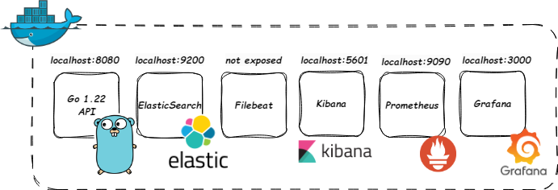
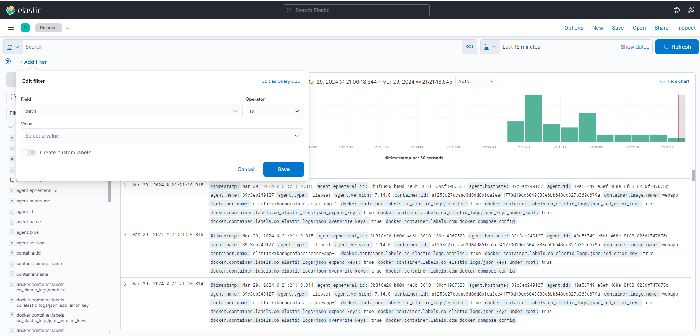
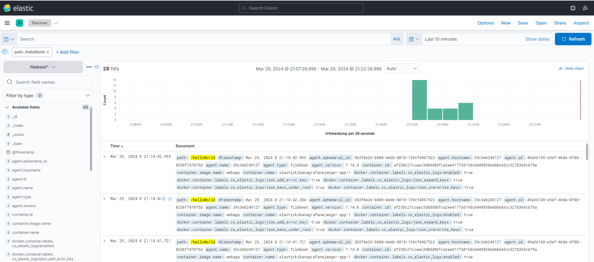
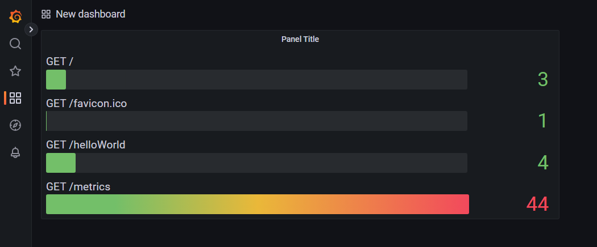

# ElasticKibanaGrafana

  

This project is a PoC of monitoring and metrics gathering in go 

## Table of contents
* [General info](#general-info)
* [Technologies](#technologies)
* [Setup](#setup)
* [Status](#status)
* [Inspiration](#inspiration)

## General info

After docker compose is run the project should be ready to go. Project consists of six docker containers:

Pic.1 Visualization of the project

Go app implements only one endpoint - _GET /helloWorld_. Each should be seen in kibana and be visualized in grafana. In kibana after the index is setup one can use filter with _path_ selector to extract API call from log:

Pic.2 Usage of filter

Pic.3 Filtered result

In grafana with usage of simple promQL query such as `rate(http_requests_count[1m])`, data can be visualized:

Pic.4 Number of calls to the specific endpoint

## Technologies
* Go 1.22
* Docker

## Setup
1. Run docker compose in src folder: `docker-compose up`

## Status
Project is: _finished_

## Inspiration
Its good to have such small PoC 
